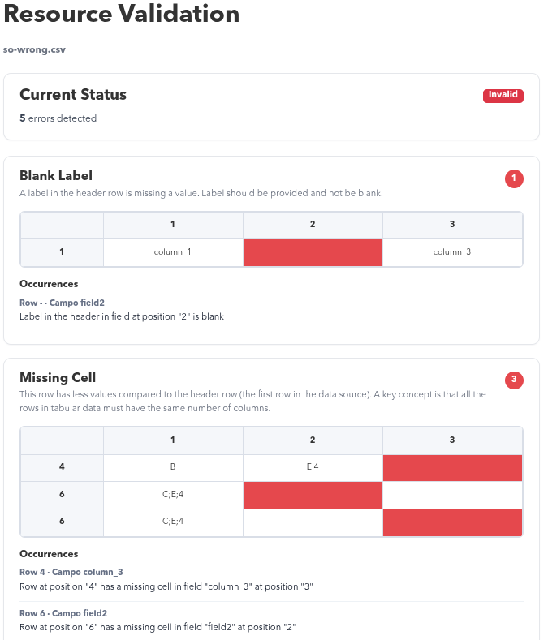

[](https://github.com/okfn/ckanext-validate/actions)

# ckanext-validate

A simple CKAN extension to validate tabular data powered by [Frictionless](https://framework.frictionlessdata.io/).

**Important:** This extension does not support any kind of Cloud Storage and it is designed for `docker-compose` setups where workers have access to the files directly. Multistorage support will be implemented once the new File API of CKAN 2.12 is released.



## How it works

Only **CSV** resources can be validated. Each validation run is validated with
Frictionless and stored as a **new row** in the `resource_validation` table —
previous results are never overwritten, so a full history is kept.

Validation can be triggered in two ways:

- **Automatically**, as a background job, whenever a CSV resource is created or
  its file is replaced. This requires the CKAN background-jobs worker to be
  running (see [Background jobs](#background-jobs)).
- **Manually**, from a resource page or via the API, by a user who has
  `resource_update` permission on the resource.

The lifecycle of each background job (queued → running → finished/error) is
tracked in the `resource_validation_jobs` table.

The validator applies some opinionated defaults (permissive numeric casting,
common missing values such as `null`/`NULL`, and all columns treated as
required). See `get_validation_report` in
[`ckanext/validate/actions/action.py`](ckanext/validate/actions/action.py) for
the exact configuration.

## Requirements

Compatibility with core CKAN versions:

| CKAN version | Compatible? |
| ------------ | ----------- |
| 2.10         | not tested  |
| 2.11         | yes         |

## Installation

1. Activate your CKAN virtual environment, for example:

   ```sh
   . /usr/lib/ckan/default/bin/activate
   ```

2. Clone the source and install it on the virtualenv:

   ```sh
   git clone https://github.com/okfn/ckanext-validate.git
   cd ckanext-validate
   pip install -e .
   pip install -r requirements.txt
   ```

3. Add `validate` to the `ckan.plugins` setting in your CKAN config file (by
   default located at `/etc/ckan/default/ckan.ini`).

4. Run the database migration to create the `resource_validation` and
   `resource_validation_jobs` tables:

   ```sh
   ckan db upgrade -p validate
   ```

5. Restart CKAN. For example, if you've deployed CKAN with Apache on Ubuntu:

   ```sh
   sudo service apache2 reload
   ```

6. (Required for automatic validation) Start the background-jobs worker — see
   [Background jobs](#background-jobs).

## API actions

### `resource_validate`

Validates a CSV resource with Frictionless and persists the result as a new
`resource_validation` row. Raises `ValidationError` if the resource is not CSV
or if Frictionless itself fails.

**Permissions:** requires `resource_update` on the resource.

**Parameters:**

| Name | Type   | Required | Description         |
| ---- | ------ | -------- | ------------------- |
| `id` | string | yes      | The resource id    |

**Example:**

```sh
curl -X POST \
  -H "Authorization: <your-api-token>" \
  -H "Content-Type: application/json" \
  -d '{"id": "<resource-id>"}' \
  "http://localhost:5000/api/3/action/resource_validate"
```

**Response:** the validated resource dict (the same shape returned by
`resource_show`). The action does **not** add validation fields to the
resource — call [`resource_validation_show`](#resource_validation_show) to read
the stored result.

### `resource_validation_show`

Returns the **latest** validation result for a resource. Raises
`ObjectNotFound` (HTTP 404) if the resource has never been validated.

**Permissions:** anyone with `resource_show` on the resource.

**Parameters:**

| Name | Type   | Required | Description     |
| ---- | ------ | -------- | --------------- |
| `id` | string | yes      | The resource id |

**Example:**

```sh
curl -X POST \
  -H "Authorization: <your-api-token>" \
  -H "Content-Type: application/json" \
  -d '{"id": "<resource-id>"}' \
  "http://localhost:5000/api/3/action/resource_validation_show"
```

**Response:**

```json
{
  "success": true,
  "result": {
    "id": 1,
    "resource_id": "<resource-id>",
    "status": "failure",
    "error_count": 2,
    "errors": [
      {
        "type": "type-error",
        "title": "Type Error",
        "description": "Type Error Description",
        "message": "Type error in the cell \"abc\" in row \"5\" and field \"date\"",
        "rowNumber": 5,
        "fieldName": "date",
        "fieldNumber": 3,
        "cells": ["abc"],
        "labels": ["date"]
      }
    ],
    "created": "2026-03-19T14:50:32.364757"
  }
}
```

#### Validation result fields

| Field         | Type    | Description                                                                 |
| ------------- | ------- | --------------------------------------------------------------------------- |
| `id`          | integer | Auto-incremented primary key                                                |
| `resource_id` | string  | CKAN resource UUID                                                          |
| `status`      | string  | `"success"` or `"failure"`                                                  |
| `error_count` | integer | Number of validation errors found                                           |
| `errors`      | list    | List of Frictionless error descriptors (see below); empty when valid       |
| `created`     | string  | ISO 8601 UTC timestamp of when the run occurred                             |

#### Error objects

Each entry in `errors` is a Frictionless error descriptor and keeps
Frictionless's **camelCase** key names, e.g. `rowNumber`, `fieldName`,
`fieldNumber`, `cells`, plus `type`, `title`, `description`, `message` and
`labels` (the resource's header, when known).

The full list of errors is always persisted — the row-limit/truncation you see
in the web UI is only applied at display time and does not affect what is
stored in the database.

If Frictionless reports the resource as invalid but exposes no row-level task
errors, a single synthetic `structure-error` entry is stored instead so the
result is never empty.

### `resource_validation_status`

Returns the current validation state of a resource, combining the latest
background job (if any) with the latest stored validation result. Useful for
polling the badge shown in the UI.

**Permissions:** sysadmin only.

**Parameters:**

| Name | Type   | Required | Description     |
| ---- | ------ | -------- | --------------- |
| `id` | string | yes      | The resource id |

**Response:**

```json
{
  "success": true,
  "result": {
    "resource_id": "<resource-id>",
    "state": "success",
    "job_status": "finished",
    "error_count": 0,
    "validation": { ... }
  }
}
```

`state` is one of `not_validated`, `pending`, `running`, `error`, `success`,
`failure`. A pending/running/error background job always takes precedence over
a previously stored validation result. `validation` is the same object returned
by `resource_validation_show`, or `null` when the resource has not been
validated yet.

### `validation_job_list`

Returns the most recent background validation jobs (read-only; supports `GET`
and `POST`).

**Permissions:** sysadmin only.

**Parameters:**

| Name     | Type    | Required | Description                                                                      |
| -------- | ------- | -------- | -------------------------------------------------------------------------------- |
| `status` | string  | no       | Filter by job status. Must be one of the `JobStatus` values (e.g. `queued`, `running`, `finished`, `error`). |
| `limit`  | integer | no       | Maximum number of jobs to return. Must be a positive integer. Defaults to `100`. |

**Example:**

```sh
curl -G \
  -H "Authorization: <your-api-token>" \
  --data-urlencode "status=error" \
  --data-urlencode "limit=50" \
  "http://localhost:5000/api/3/action/validation_job_list"
```

**Response:**

```json
{
  "success": true,
  "result": [
    {
      "id": 12,
      "resource_id": "<resource-id>",
      "status": "finished",
      "created": "2026-04-15T14:12:18.022408",
      "finished": "2026-04-15T14:12:25.110994"
    }
  ]
}
```

Note: manually triggered validations (via `resource_validate`) run
synchronously and do **not** create a background job, so they never appear in
this list.

## Web interface

- **Resource validation page** — `/dataset/{package}/resource/{resource}/validate`
  lets an editor with `resource_update` run validation and review the grouped
  error report. CSV resources also show a live status badge (auto-refreshing
  while a job is pending/running) on the dataset and resource pages.
- **Validate File** (admin) — `/ckan-admin/testfile` lets a sysadmin upload an
  arbitrary CSV to validate it without attaching it to any dataset. The uploaded
  file is not stored.
- **Validation Jobs** (admin) — `/ckan-admin/validation-jobs` lists recent
  background jobs and allows filtering by status.

## Background jobs

Automatic validation on resource create/update runs through CKAN's RQ-based
job queue, so a worker must be running for queued jobs to be processed:

```sh
ckan -c /etc/ckan/default/ckan.ini jobs worker
```

See the CKAN docs: https://docs.ckan.org/en/2.11/maintaining/cli.html

When a CSV resource's file is replaced, a new job is enqueued (unless one is
already queued for that resource). When a resource is deleted, its background
job records are removed.

## Config settings

None.

## Developer installation

To install ckanext-validate for development, activate your CKAN virtualenv and
do:

```sh
git clone https://github.com/okfn/ckanext-validate.git
cd ckanext-validate
pip install -e .
pip install -r dev-requirements.txt
```

## Tests

To run the tests, do:

```sh
pytest --ckan-ini=test.ini
```

## License

[AGPL](https://www.gnu.org/licenses/agpl-3.0.en.html)
